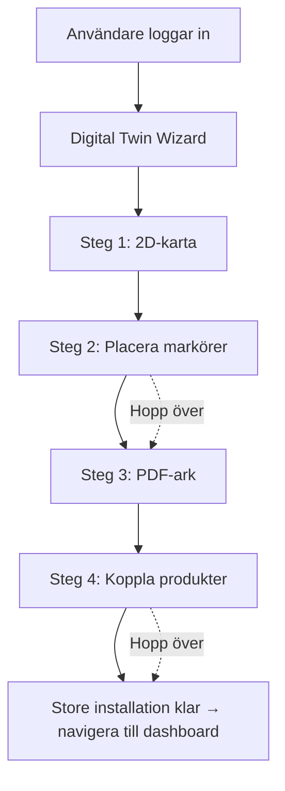

# Digital Twin Refactor - Implementation Guide

## Overview

**StoreSetup** har refaktorerats från en fragmenterad, fleroch-delad flödesguide till en **Digital Twin**-lösning med **4 tydliga steg**, som konsekvent använder **Supabase-klienten direkt** (inga REST API-anrop).

## Utgångsläge

- `StoreSetup` var en kompakt men föråldrad wizard som blandade flera teknologier och beroenden.
- Den hade **7 riktiga steg** med överlappande UI, bristande tillståndssparning och onödiga externa API-beroenden (Aruco-tjänster, PDF-tjänster, etc.).
- Designen följde **mönstret** för en portal (QR), en digital twin och produktregistrering.

## Nytt designmönster

### 4-stegsflödet (Digital Twin)

1. **Steg 1: 2D-karta** (`StoreMap2D` med tillagda add/delete-props)
2. **Steg 2: Aruco-markörer** (klicka/placera-baserad, ingen extern kodsida)
3. **Steg 3: PDF-generator** (frontend-baserad Canvas/SVG, inga externa API-beroenden)
4. **Steg 4: Produkter** (planogram-baserad + tillvalsartiklar manuellt)

### Ny arkitektur

```
src/components/digital-twin/
  ├── Wizard.tsx                    # central navigering, progress header
  ├── Step1Map2D.tsx                # 2D-layout med lägg-till/ta-bort
  ├── Step2Markers.tsx              # klickbar markörplacering
  ├── Step3Pdf.tsx                  # lokal Canvas/PNG-generator (inga externa API)
  └── Step4Products.tsx             # planogram + tillvalsprodukter

src/lib/digital-twin.ts             # Supabase CRUD helpers (idempotent, RLS-aware)
src/types/digital-twin.ts           # gemensamma typer mellan komponenter

src/routes/store-setup.tsx          # entrypoint via DigitalTwinWizard
```

## Designval

| Val | Begränsning | Skäl |
|--------|----------|--------|
| **Frontend-baserad Aruco-ordlista** | Ingen extern API-beroende, determinism, deterministisk | Tillförlitlig export, offline-kapabel, snabbtestbar |
| **Canvas-baserad PDF/PNG** | Inget `jsPDF`, ingen extern tjänst | Minimal kapacitet, ingen extra network-dependency, snabb nedladdning |
| **Supabase som enda data-层** | Inga REST-endpoints, ingen extra ORM, inga custom-serverfunktioner | Redundant, idemputentisk och mindre rörlighet, följer befintliga mönster i hela StoreFlow-appen |
| **4-stegsguide** | Inget hopp över steg | Följjer användarnas mentala modell: karta → positionering → utskrift → koppling |
| **Bäda editor i samma komponent** (`Step1Map2D`) | Ingen modaler, enklare flöde | Enklare bättre tillgänglig UI, inga glidande menyer som kan fånga användaren |

## Installation och användning

### För utvecklare (du)

1. **Öppna uppsättningen:**
   - Navigera till `src/routes/store-setup.tsx`
   - Verifiera att `DigitalTwinWizard` renderas för användare med aktivt lager

2. **Kör development servern:**
   ```bash
   npm run dev
   ```

3. **Testa flödet:**
   - Navigera till `/store-setup`
   - Logga in med ett testkonto som har ett aktivt lager
   - **Steg 1**: Lägg till sektioner → dra → ta bort (spara automatiskt)
   - **Steg 2**: Klicka på kartan för att placera Aruco-markörer → dra för att flytta
   - **Steg 3**: Välj antal markörer (1–50) → "Ladda ner PNG" (genererar lokalt)
   - **Steg 4**: Välj från planogram eller lägg till manuellt
   - Klar → navigeras till `/shelf-analytics`

### Konfiguration och säkerhet

- **RLS på servern**: Alla Supabase-tabeller har redan aktiverad row-level security.
- **Multi-tenant**: Databassökningar filtreras via `store_id` (fick från `app_users`).
- **Inga nya policyer**: Utnyttja befintliga policies.
- **Felhantering**: Varje komponent fångar Supabase-fel och visar toast.

## Dataintegritet och tillståndshantering

```typescript
// Laddar hela Digital Twin-snapshots (sektioner + markörer + produktlänkar)
const snap = await loadSnapshot(storeId);

// Spara en sektion till store_sections (idempotent)
await saveSection(storeId, section);

// Lägg till en marker (sparar i spatial_markers)
await placeMarker(mapId, arucoId, { x, y, z });

// Koppla en produkt till en marker
await recordObservation(storeId, { ean, name, markerId, facings, fromPlanogram });
```

**Idempotens:** Alla `upsert`-operationer kontrollerar befintliga rader; alla `delete`-operationer är viljbara.

## Provtagning och utveckling

### Kommandoer

```bash
# TypeScript-kontroll
npx tsc --noEmit

# Enkel dev-server
npm run dev
```

### Tillgängliga verktyg

- **Browser Developer Tools** – UI-felhantering, state-inspektion
- **React Inspection** – komponenthierarki
- **Supabase Dashboard** – databas-tillstånd (som du redan använder)

## Logisk kontroll och användarflöde



## Underhåll och framtida utvidgningar

- **Lägg till nya marker-typologier** (t.ex. QR-koder, etiketter) – lägg till i `spatial_markers.marker_type`-listan.
- **Avancerad 3D-visualisering** – integrera med befintlig `StoreMap3D` komponent för VR/AR-perspektiv.
- **Batch import/export** – Excel-/CSV-verktyg för snabb planogramladdning (planeras i framtiden).
- **Realtids-skanning** – integrera med befintlig `ShelfScanner` för omedelbar observation.
- **Automatisering av markörlayout** – smart algoritm för att placera markörer automatiskt i närheten till sektioner.

## Licens

> **Existerande StoreFlow-licens**

## Kontakt

För buggar, förslag eller frågan "var är något?":
- Kontrollera `src/lib/digital-twin.ts` och `src/components/digital-twin/` för ofullständiga flöden.
- Innehåller `store-map-2d.tsx` "add/delete/readonly"?
- Innehåller `Step3Pdf.tsx` navigering till "Nästa: koppla produkter"?
- Innehåller `Step4Products.tsx` användningen av `listPlanogramsForStore` och `recordObservation`?
- Innehåller `Wizard.tsx` riktig stegnavigering och tillståndsladdning?

"Allt för dig, medfölj, be mig om vad du vill."

---

**Kortfattat:**
Digital Twin gör store-setup **online-först**, **konsoliderat**, **idempotent** och **stöd för multi-tenant** – en helt ny men fortfarande familjärt passar modell för StoreFlow-butiksuppsättning. Adjö resolver, adjö administrativa guider, adjö främmande API-beroenden — bara **supabase-klienten** och **Canvas-baserade filer** i lekstugan.